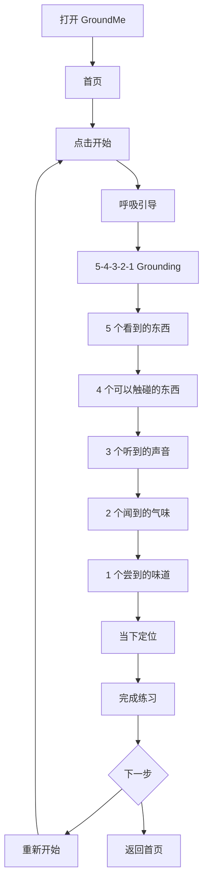

# GroundMe 心安安 — 产品流程

## 核心使用流程

```mermaid
flowchart TD
    A[打开 GroundMe] --> B[首页]
    B --> C[点击开始]
    C --> D[呼吸引导]
    D --> E[5-4-3-2-1 Grounding]
    E --> F[5 个看到的东西]
    F --> G[4 个可以触碰的东西]
    G --> H[3 个听到的声音]
    H --> I[2 个闻到的气味]
    I --> J[1 个尝到的味道]
    J --> K[当下定位]
    K --> L[完成练习]
    L --> M{下一步}
    M --> N[重新开始]
    M --> O[返回首页]
    N --> C
```

## 流程说明

1. 用户打开小程序
2. 进入首页
3. 点击开始
4. 进入呼吸引导
5. 完成 5-4-3-2-1 Grounding
6. 进行当下定位
7. 完成练习
8. 用户可以重新开始或返回首页
